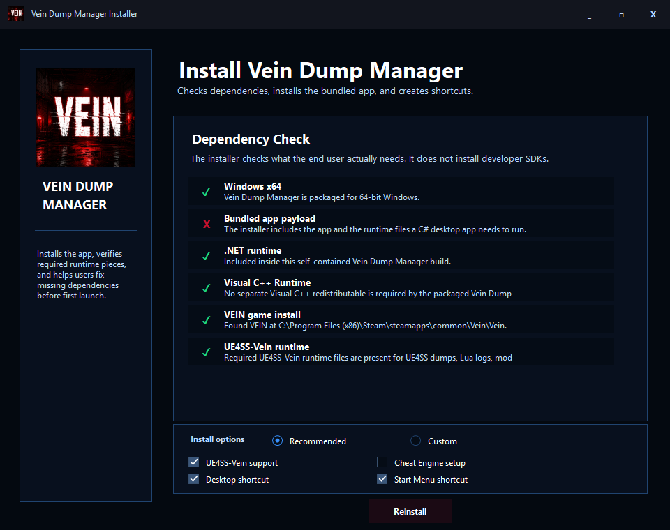
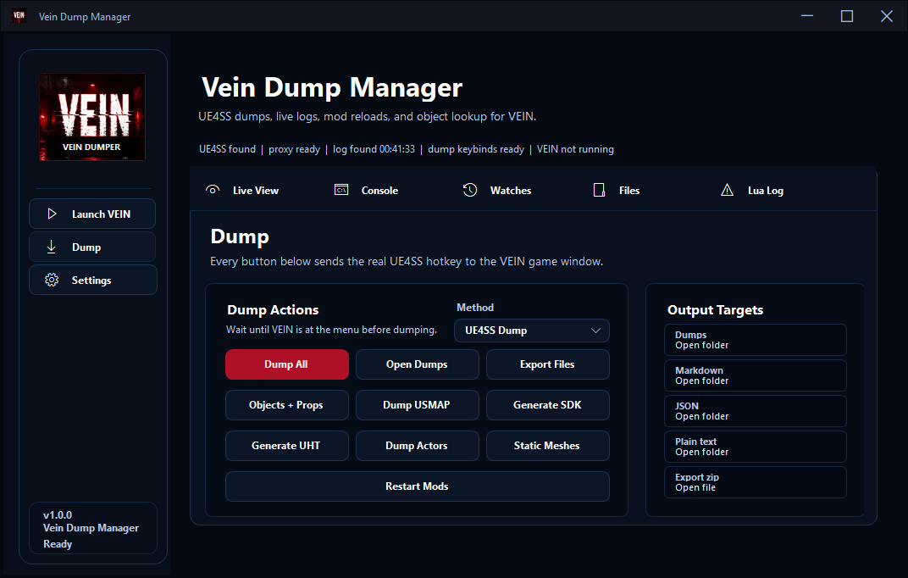
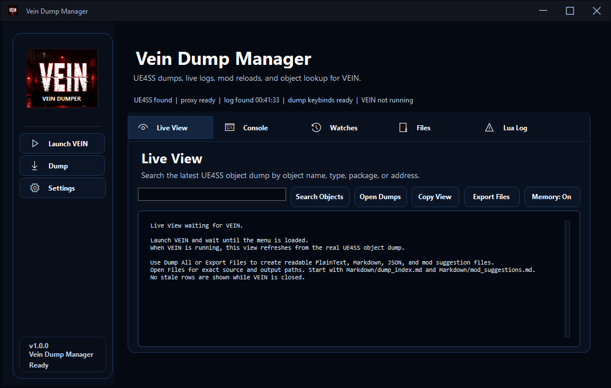
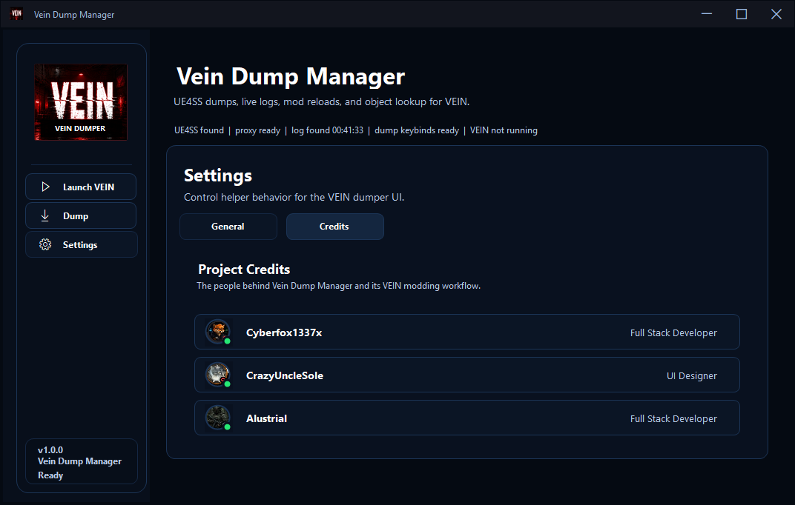

# Vein Dump Manager

Vein Dump Manager is a Windows desktop tool for VEIN modding. It helps launch VEIN, detect UE4SS, watch the live UE4SS log, run UE4SS dumps, organize dump output, and optionally start the bundled Cheat Engine Lua memory-dump workflow.

The normal end-user path is the installer. Developers can build the app from source with the commands below.

## Screenshots

### Installer



### Dump Command Center



### Live View



### Project Credits



## What This Tool Does

- Launches VEIN through Steam.
- Detects the local VEIN Win64 folder and UE4SS folder.
- Shows real UE4SS log output inside the app.
- Sends UE4SS dump hotkeys for objects, properties, actors, static meshes, USMAP, SDK, and UHT dumps.
- Exports useful dump output into readable Markdown, JSON, plain text, logs, and export folders.
- Shows generated dump files and exact paths in the Files tab.
- Includes a headless Cheat Engine Lua workflow for memory-dump research when Cheat Engine is installed.
- Includes a first-run installer/bootstrapper that checks required pieces and can install UE4SS-Vein support into the correct VEIN folder.

## Requirements

- Windows 10 or Windows 11, 64-bit.
- Steam copy of VEIN installed locally.
- VEIN installed at the normal Steam path, or a compatible path detected by the app.
- For UE4SS dump features: UE4SS-Vein support installed. The installer can install the bundled UE4SS-Vein runtime files.
- For Cheat Engine memory dump mode: Cheat Engine must be installed separately if you choose to use that method.

The published installer is self-contained and includes the .NET runtime files needed by the desktop app. End users should not need to install the .NET SDK.

## Recommended Install

1. Download the latest `VeinDumpManagerInstaller-ready-to-ship.zip` from the GitHub Releases page.
2. Extract the zip to a normal folder, such as `Downloads\VeinDumpManagerInstaller`.
3. Run `Vein Dump Manager Installer.exe`.
4. Choose `Recommended` unless you know exactly what you want to customize.
5. Leave `UE4SS-Vein support` checked if you want dump buttons, Lua logs, and mod reloads to work.
6. Click `Install` or `Reinstall`.
7. Launch Vein Dump Manager from the Start Menu or Desktop shortcut.

If Windows blocks writing into the Steam VEIN folder, run the installer as administrator and try again.

## Using Vein Dump Manager

1. Open Vein Dump Manager.
2. Click `Launch VEIN`.
3. Wait until VEIN reaches the main menu.
4. Open the `Dump` section.
5. Select the dump method:
   - `UE4SS Dump` for normal UE4SS object/property/actor/static mesh dumps.
   - `Cheat Engine Memory Dump` for the optional memory scan workflow.
6. Click `Dump All` for the full app workflow, or choose a specific dump button.
7. Watch the `Console`, `Live View`, `Watches`, and `Lua Log` tabs for real status and errors.
8. Open the `Files` tab to find generated outputs.

## Output Folders

The app organizes dump results under the VEIN UE4SS dump folder:

```text
Dumps/
  Markdown/
  JSON/
  PlainText/
  Logs/
  Exports/
  GameFiles/
```

Useful files include:

- `Markdown/dump_index.md` - human-readable summary of the dump.
- `Markdown/objects.md` - object names, class names, paths, and modding notes.
- `JSON/dump_index.json` - machine-readable summary.
- `PlainText/objects.txt` - plain text object list.
- `Logs/app.log` and `Logs/ue4ss_lua.log` - troubleshooting logs.
- `Exports/latest_export.zip` - compact export package for sharing.

## Tabs

- `Live View` - readable object dump view and search.
- `Console` - live UE4SS log output.
- `Watches` - process, dump, and error status.
- `Files` - exact output paths and generated files.
- `Lua Log` - UE4SS Lua/mod log output.
- `Settings` - helper settings and project credits.

## Build From Source

Install the .NET 8 SDK if you want to build from source.

Build the main app:

```powershell
dotnet build .\tools\vein-ue4ss-control-panel\Vein.Ue4ss.DumpLog.csproj -c Release
```

Publish the self-contained app payload:

```powershell
dotnet publish .\tools\vein-ue4ss-control-panel\Vein.Ue4ss.DumpLog.csproj -c Release -r win-x64 --self-contained true -o .\dist\VeinDumpManager
```

Build the installer:

```powershell
dotnet publish .\tools\vein-dump-manager-installer\VeinDumpManager.Installer.csproj -c Release -r win-x64 --self-contained true -o .\dist\VeinDumpManagerInstaller
```

Or run:

```powershell
.\scripts\publish-release.ps1
```

## Safety Notes

- Do not run dumps on a save you care about without backups.
- Use a throwaway save when testing mods or memory values.
- Cheat Engine mode is for local/offline research. Do not use it to cheat in multiplayer or violate server rules.
- The app writes dump files and installer backups, but it should not edit saves, PAKs, or server config directly.
- If something fails, check the app status line, Console tab, Lua Log tab, and `Dumps/Logs`.

## Credits

- Cyberfox1337x - Full Stack Developer
- CrazyUncleSole - UI Designer
- Alustrial - Full Stack Developer

## Third-Party Components

This project bundles the minimum UE4SS-Vein runtime files needed by the installer. See `THIRD_PARTY.md` and included upstream license files before redistributing modified packages.
